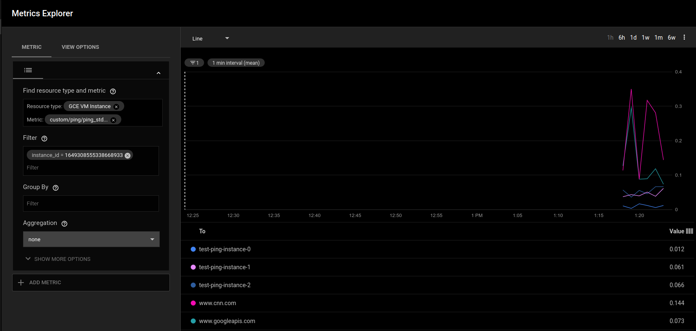
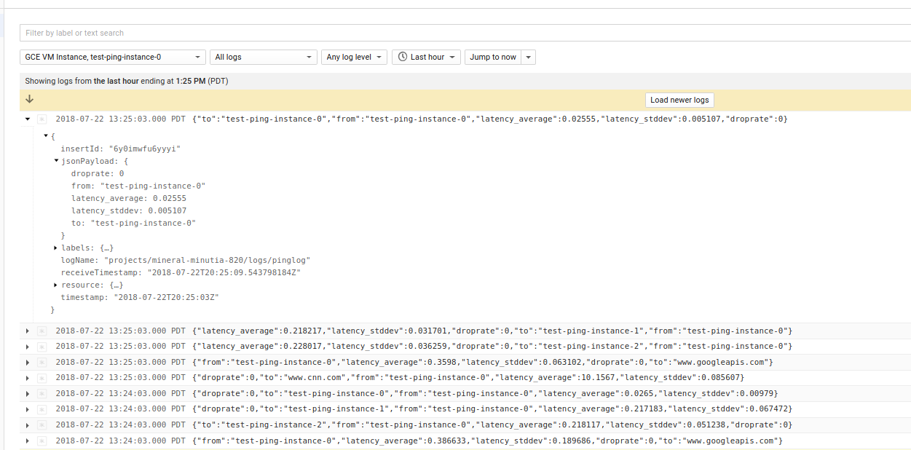
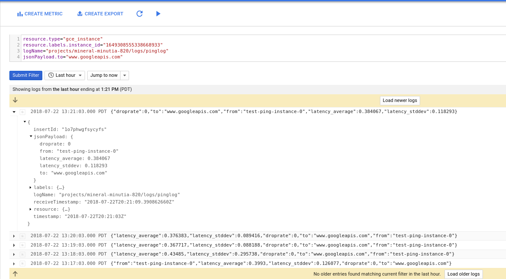
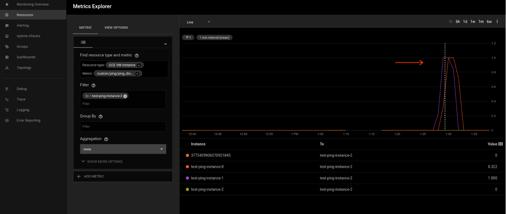
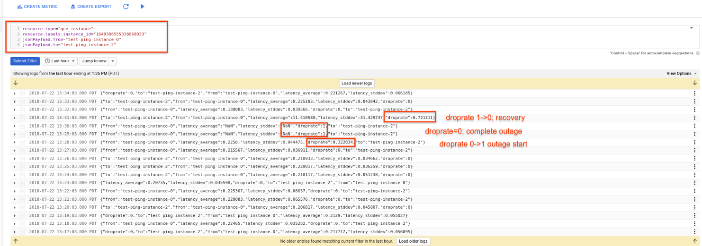

# Using collectd ping plugin to monitor VM->VM latency with Google Stackdriver

Customers often want to instrument their application and monitor VM->VM and VM->external service latency as seen by simple ping probers between instances or containers.  This article covers how to use an off the shelf [Ping Plugin](https://collectd.org/documentation/manpages/collectd.conf.5.shtml#plugin_ping) for ```collectd``` together with Google Cloud's logging and monitoring facilities to acquire and process latency statistics.  Google Stackdriver uses collectd for monitoring and fluentd for logging so this article covers how to:

1. ```Send ping statistics to Cloud Monitoring:```  Use Stackdriver Monitoirng to emit custom metrics representing ping plugin statistics.
2. ```Send ping statistics to Cloud Logging``` Use Stackdriver Monitoring to _write_ the output of a *custom* ping plugin to a log file and then use Stackdriver Logging to send those to Google

Ofcourse the preferable way to use Stackdriver ```collectd``` would be to emit statstics directly to Google Stackderiver as done by the supported set of [plugins](https://cloud.google.com/monitoring/agent/plugins/). At the time of writing, (7/21/18), the the ping collectd plugin is not supported....but thats ok, we can still
add on collectd and configure it to emit [custom metrics to GCP](https://cloud.google.com/monitoring/agent/custom-metrics-agent#writing_custom_metrics_with_the_agent).

Note that certain cloud providers surface aggregated, sampled statistics such as [VPC Flow Logs](https://cloud.google.com/vpc/docs/using-flow-logs) and the usecase for this is to view connectivity and latency "as seen" by the application using a ground truth ping statistics (or if you dont' want to instrument the whole network with detailed flow logs)


## Setup

The first step is to create the ping plugin shared object and enable your VM to run the ping plugin.


### Build custom ping.so

The following command will build a debian image and compile the ping plugin

If you are using technique , then you can use any standard ```ping.so``` and place that into the VM.  If you want to try technique (2: ```Send pingstatistics to Cloud Logging```), then you must compile the version of ```ping.c``` i've attached to this repo.

If you want to use

1. ```Send ping statistics to Cloud Monitoring```
  Then simply run the docker commands below to acquire ```ping.so``` using collectd defaults

2. ```Send pingstatistics to Cloud Logging```
  Then you must compile the version of ```ping.c``` i've attached to this repo.  To do that, edit ```Dockerfile``` and uncomment
   ```
   ADD ping.c collectd/src/ping.c
   ```

For both, acquire ```ping.so```:

```
docker build -t docker_tmp .
docker cp `docker create docker_tmp`:collectd/.libs/ping.so .
```

>> Note, ping plugin requires ```liboping0``` so any host were you want to run this plugin, please also install 

```
apt-get install -y liboping0
```

## Send ping statistics to Cloud Monitoring

In this mode, the the ping plugin's outputs are translated by collectd and emitted to Cloud Monitoring as custom metrics.  This is the more standard way to emit metrics to GCP.   The sample in Stackdriver is showng below for ```custom.googleapis.com/ping/ping_stdev``` metric for a given instance source and no filters on destination.   



The sample configuration for this is included in the deployment manager script that is also included in this repo.  Essentially, its just a matter of setting up a collectd filter.


```xml
          LoadPlugin ping
          <Plugin ping>
            Host "instance-1"
            Host "instance-2"
            Host "www.googleapis.com"
          </Plugin>

          LoadPlugin match_regex
          LoadPlugin target_set
          LoadPlugin target_replace

          PreCacheChain "PreCache"
          <Chain "PreCache">
            <Rule "jump_to_custom_metrics_from_ping">
              <Match regex>
                Plugin "^ping$"
              </Match>
              <Target "jump">
                Chain "PreCache_ping"
              </Target>
            </Rule>
          </Chain>

          <Chain "PreCache_ping">
            <Rule "rewrite_ping_drop_rate">
              <Match regex>
                Plugin "^ping$"
                Type "^ping_droprate$"
              </Match>

              <Target "set">
                MetaData "stackdriver_metric_type" "custom.googleapis.com/ping/ping_droprate"
                MetaData "label:to" "%{type_instance}"
              </Target>
            </Rule>

            <Rule "rewrite_ping">
              <Match regex>
                Plugin "^ping$"
                Type "^ping$"
              </Match>

              <Target "set">
                MetaData "stackdriver_metric_type" "custom.googleapis.com/ping/ping"
                MetaData "label:to" "%{type_instance}"
              </Target>
            </Rule>

            <Rule "rewrite_ping_stddev">
              <Match regex>
                Plugin "^ping$"
                Type "^ping_stddev$"
              </Match>

              <Target "set">
                MetaData "stackdriver_metric_type" "custom.googleapis.com/ping/ping_stddev"
                MetaData "label:to" "%{type_instance}"
              </Target>
            </Rule>  

            <Rule "go_back">
              Target "return"
            </Rule>
          </Chain>
```

As mentioned earlier, you must install ```libping0``` on any host were you setup the ping plugin


## Send ping statistics to Cloud Logging

This technique is just for demonstration as it utilizes a modification to ping plugin to emit its metrics as log lines and not statistics.  

Basically, the output for the ping plugin is not sent to cloud monitoring but rather the output is written to a file ````/var/log/pinglog.log``` on the host.  From there Cloud Logging's fluentd will read that file and batch emit statistics to GCP.

For example, here are some *json structured** cloud logging ping statistics

The following shows all the logs for a given VM


and since they are structured, its easy to construct a filter or [log to metric](https://cloud.google.com/logging/docs/logs-based-metrics/):



Here are the modifications we made to the [ping.c](ping.c) to write the log lines:

```cpp
submit(hl->host, "ping", latency_average);
submit(hl->host, "ping_stddev", latency_stddev);
submit(hl->host, "ping_droprate", droprate);
 // begin sal
    char hostname[1024];
    gethostname(hostname, 1024);

  FILE *fp;
  fp = fopen("/var/log/pinglog.log", "a");
  if (fp == NULL) {
     ERROR("I couldn't open /var/log/pinglog.log for appending.\n");
  }
  fprintf(fp, "{\"time\": \"%lu\", \"to\": \"%s\", \"from\": \"%s\", \"latency_average\": %f, \"latency_stddev\": %f, \"droprate\": %f }\n", (unsigned long)time(NULL),hl->host, hostname, latency_average, latency_stddev, droprate);
  fclose(fp);
```

The attached ```ping.so``` is already compiled for these changes.   The attached deployment manager template reads the same ping.so from a public GCS bucket here:

```
https://storage.googleapis.com/mineral-minutia-820/ping.so

$ gsutil stat gs://mineral-minutia-820/ping.so
```

You ofcourse dont' have to use the precompiled ```ping.so``` and can just compile it with the instructions in the setup step.


## Build and test

Anyway, lets run a sample Deployment Manager script which will spin up N instances with the collectd plugin and then proceed to setup the Plugin to connect to each node:


```xml
          LoadPlugin ping
          <Plugin ping>
           
            Host "{{env['deployment'] }}-{{ properties["instancePrefix"] }}-{{i}}"
           
            Host "www.googleapis.com"
            Host "www.cnn.com"
           Interval 1
          </Plugin>

```

Once you deploy, you should see three instances
```
$ gcloud deployment-manager deployments create test --config cluster.yaml 

NAME                  TYPE                 STATE      ERRORS  INTENT
test-ping-instance-0  compute.v1.instance  COMPLETED  []
test-ping-instance-1  compute.v1.instance  COMPLETED  []
test-ping-instance-2  compute.v1.instance  COMPLETED  []
```
Give it a couple of minutes and then _refresh_ cloud logging console for any instance you've created.  You should see  a new log type of ```pinglog```.

You can also query the stackdriver metrics explorer too:

```json
{
 "metricDescriptors": [
  {
   "name": "projects/mineral-minutia-820/metricDescriptors/custom.googleapis.com/ping/ping",
   "labels": [
    {
     "key": "to"
    }
   ],
   "metricKind": "GAUGE",
   "valueType": "DOUBLE",
   "description": "Auto-created custom metric.",
   "type": "custom.googleapis.com/ping/ping"
  },
  {
   "name": "projects/mineral-minutia-820/metricDescriptors/custom.googleapis.com/ping/ping_droprate",
   "labels": [
    {
     "key": "to"
    }
   ],
   "metricKind": "GAUGE",
   "valueType": "DOUBLE",
   "description": "Auto-created custom metric.",
   "type": "custom.googleapis.com/ping/ping_droprate"
  },
  {
   "name": "projects/mineral-minutia-820/metricDescriptors/custom.googleapis.com/ping/ping_stddev",
   "labels": [
    {
     "key": "to"
    }
   ],
   "metricKind": "GAUGE",
   "valueType": "DOUBLE",
   "description": "Auto-created custom metric.",
   "type": "custom.googleapis.com/ping/ping_stddev"
  }
 ]
} 
```

## Simulated Outage Detection

Ok, now we've got the metrics and for good measure, the logs too.  Lets simulate an outage.

Go to the Compute Engine-->Instances section of the cloud console and click 'stop' on ```instance-2```. 

Wait a couple of minutes and query the logs and stackdriver charts for ```droprate```.  What you should see is the droprate become non-zero in the first sample and in the next minute, ```droprate=1```.  The ping plugin prober frequency is every minute but aggregates the data for Stackdriver.   What that means is you are seeing aggregated data (i.,e a non zero value for the first minute for ```droprate```...and a decreasing value for that same metric during recovery)

- Monitoring


- Logging



---

## References

- [Ping Plugin](https://collectd.org/documentation/manpages/collectd.conf.5.shtml#plugin_ping)
-  - [https://collectd.org/wiki/index.php/Plugin:Ping]

- [GCP Custom Metrics with Stackdriver](https://cloud.google.com/monitoring/agent/custom-metrics-agent#writing_custom_metrics_with_the_agent)

- [python monitoring client](https://pypi.org/project/google-cloud-monitoring/)

## Appendix


### Cloud Client monitoring library

The following snippet queries the cloud monitoring custom metric for ping using [python monitoring client](https://pypi.org/project/google-cloud-monitoring/).

Remember to add in the ```instance_id``` for the VM you are seeking to display the metrics for.

```python
# virtualenv env
# source env/bin/activate
# pip install google-cloud-monitoring==0.30.0

import datetime, time
import pprint
from google.cloud import monitoring_v3
from google.cloud.monitoring_v3.query import Query

client = monitoring_v3.MetricServiceClient()

#metric_type = 'custom.googleapis.com/ping/ping_droprate'
#metric_type = 'custom.googleapis.com/ping/ping'
metric_type = 'custom.googleapis.com/ping/ping_stddev'
instance_id = '1649308555338668933'
metric_label_to_filter = 'www.googleapis.com'

now = datetime.datetime.utcnow()
fifteen_mins_ago =  now - datetime.timedelta(minutes=15)

q = Query(client, project='mineral-minutia-820', metric_type=metric_type, minutes=1)
q = q.select_interval(end_time=now,start_time=fifteen_mins_ago)
q = q.select_resources(instance_id=instance_id)
q = q.select_metrics(to=metric_label_to_filter)

for timeseries in q.iter():
  print '========== Metric: '
  pprint.pprint(timeseries.metric)
  pprint.pprint(timeseries.resource)
  print '========== Points: '
  for p in timeseries.points:
   #print repr(p)
   print str(p.interval.start_time.seconds) + ' --> ' + str(p.interval.end_time.seconds) + '  : [' +  str(p.value.double_value) + ']'
  print('-----------------')

```

Which gives a sample output like:

```
========== Metric: 
labels {
  key: "to"
  value: "www.googleapis.com"
}
type: "custom.googleapis.com/ping/ping_stddev"

type: "gce_instance"
labels {
  key: "instance_id"
  value: "1649308555338668933"
}
labels {
  key: "project_id"
  value: "mineral-minutia-820"
}
labels {
  key: "zone"
  value: "us-central1-a"
}

========== Points: 
1532290863 --> 1532290863  : [0.118293]
1532290803 --> 1532290803  : [0.089416]
1532290743 --> 1532290743  : [0.088188]
1532290683 --> 1532290683  : [0.295738]
1532290623 --> 1532290623  : [0.126077]
-----------------
```